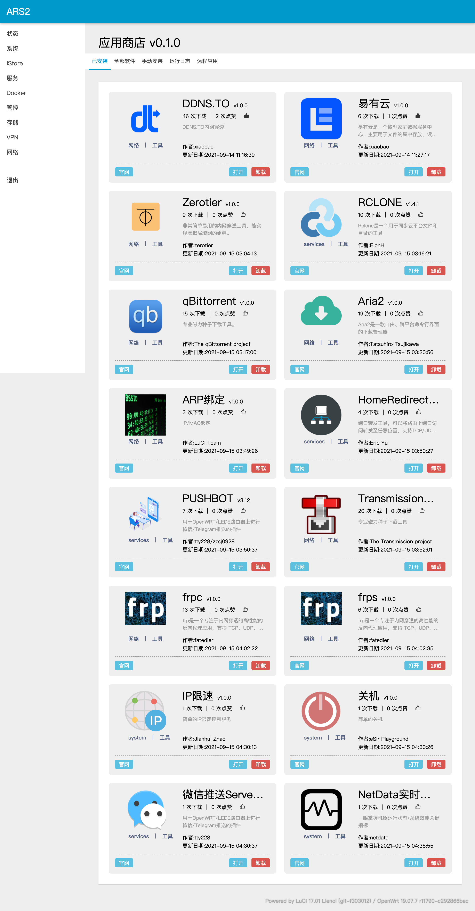

# iStore

## 介绍

iStore 是一个[开源](https://github.com/linkease/istore)且标准的 OpenWRT 软件中心实现。

是属于易有云团队的固件 [iStoreOS](https://github.com/linkease/istoreos) 的一部分。

iStore 的设计目标：

1. 方便用户安装插件
2. 每个插件都有教程，方便初学者入门使用插件
3. 适配所有的 OpenWRT 皮肤，以及移动端
4. 全部基于 OpenWRT 的标准接口开发，不用以前 KoolShare LEDE 的特有的插件风格的软件中心

iStore 的无法弥补的缺陷：

1. 因为 OpenWRT 版本特别多，导致不同平台的插件依赖不一样。所以即使你的系统能安装 iStore，iStore 里面的插件不一定能安装
2. 我们需要固件开发者自主集成 iStore，并解决 iStore 里面的各种插件的依赖

我们建议固件开发者集成 iStore，这样固件开发者只需要发布一个精简固件，用户可以按需安装自己喜欢的插件。还能共享插件的教程，独立更新某个插件版本。

> 21版本的固件安装iStore需要依赖 `luci-compat`

## 功能预览

